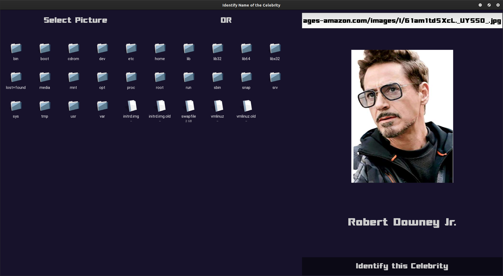

# Identify the name of the Celebrity in a given image.

- Browse any Image on your local machine or paste the url of an online image and then you will get the name of the celebrity in the given image just after clicking on the button Identify the Celebrity.

- The entire GUI is developed using **[Kivy](https://kivy.org/#home)** framework in python.

- To Identify the celebrity in an image an API is used that is provided by [**SightEngine**](https://sightengine.com/docs/getstarted).


# Requirments

- **Kivy** (for GUI)

  ```
  pip install kivy
  ```

- **urllib** (for online image)

  ```
  pip install urllib
  ```

- **SightEngine API** (for API accessing)

  ```
  pip install sightengine
  ```

  

# How to run

Simply run the file **`kivyDemo.py`** using **`python kivyDemo.py`** and then paste the url of an online image or browse an offline image.


# Screenshot(s)




# References

- Kivy 

  https://kivy.org/#home

- SightEngine 

  https://sightengine.com/

  https://sightengine.com/docs/getstarted

  ```python
  # if you haven't already, install the SDK with "pip install sightengine"
  from sightengine.client import SightengineClient
  client = SightengineClient('{api_user}', '{api_secret}')
  output = client.check('{model}').set_file('/full/path/to/image.jpg')
  ```
